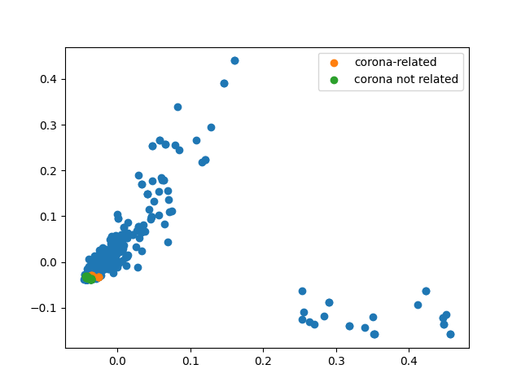
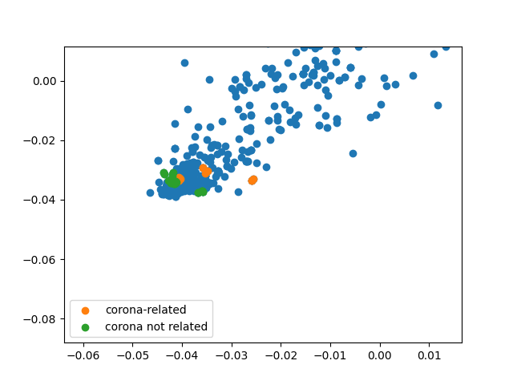
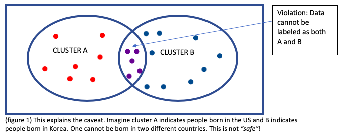
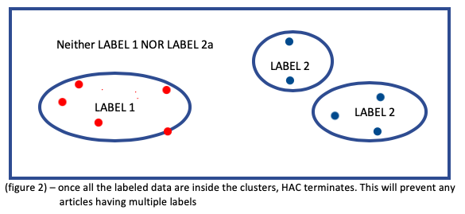

# DataScrape
## Overview
The project is started to make proposal made in CS540(Introduction to AI) into a realization.
The script implements HAC on PCA applied data. However, unlike what is commonly and normally done,
I focused on using the technique to label unlabeled data for its potential use in Neural Network later.

## Installation
```bash
pip install scipy
pip install matplotlib
pip install sklearn
pip install nltk
pip install newspaper3k         # package for parsing and collecting news
```

## Usage
```bash
python test.py
```
It may take couple minutes to compute the result.

## Result and Takeaway
I randomly picked a few articles under 'articles/' to be corona related articles [32, 37, 243] and
corona non-related articles [5, 347, 510]. Then when I ran algorithm, it was successful to increase
a size of labeled data.
```bash
{'corona-related': [356, 37, 147, 32, 142, 103, 342, 512, 38, 98, 18, 136, 3, 243], 'corona not related': [59, 167, 64, 171, 180, 5, 107, 316, 372, 292, 347, 253, 329, 416, 421, 60, 168, 430, 88, 91, 249, 454, 73, 412, 376, 275, 306, 288, 293, 99, 510]}
```
However, the plot below shows the collection of labeled data is so minuscule to the total dataset I have
provided.<br>
<br>

Let's zoom into the cluster region.<br>


I still have so much to improve in performance. There could be a lot of things that I overlooked
in the implementation of my algorithm, or maybe even the approach itself is incorrect. I found out that
collision of cluster occurs so early that iteration stops without so much of clustering.

To remedy this issue, we can apply qausi-expectation value for each cluster than decide to choose
max when iteration terminates long later.

Also, better set of data can be collected. From randomly picking the articles that have been collected,
I found out many of them are not corona virus related. Thus, obviously, it will be difficult to 
maintain a meaningful feature space related to 'corona virus' when PCA is applied to the dataset.

## Proposal
### “Safe” Data Labeling via HAC with PCA
### Abstract:
Neural Network (NN) is a popular approach to classify numerous data in real time. In the midst of COVID-19, this methodology can profoundly assist local government to be always updated on the latest COVID-19 situation by analyzing real time news articles that are collected. This may allow the government to take action quickly to minimize impact and maximize efforts. However, many will face challenges to build an optimized model as they lack properly labeled train data. I propose using Hierarchical Agglomerative Clustering (HAC) with Principal Component Analysis (PCA) and to cluster around a few labeled data in order to return labeled data with a small margin of error, with which one then can implement NN. The key word “safe” is used throughout this proposal to indicate that certain changes in the HAC allows labeling to be intuitive and caveat free.

### Project:
The project focuses on “safely” labeling raw data. Each article collected by a web crawl program will be represented as a multivariate vector and set of articles will be reduced to about fifth dimension through PCA due to the many benefits the algorithm provides. Then any human will give very few articles their corresponding labels (here, labels can be any reasonable classification) and perform HAC around the labeled articles. For unlabeled articles, we regard them as articles that do not fit into any of the classification we assumed, so they are thrown out. The labeled data can later be implemented in NN. The project will be introduced in three steps: 1. collecting and cleaning data, 2. implementing PCA, and 3. safe labeling with HAC.

#### 1. Collecting and Cleaning Data 
The project will focus on retrieving text data online because the amount of news articles online is massive and new articles get uploaded in real time.
~~A web crawl with HTML parser module will be used in the program. The idea is to request news page on Google (the link below is the same as searching “coronavirus news” in Google News).
https://www.google.com/search?q=coronavirus+news&source=lnms&tbm=nws
Then crawl links by searching HTML tag within the requested page, and its contents will be extracted.~~(python package 'newspaper3k' was used for this section).
The data will be cleaned into a Bag of Words format (BoW or multivariate vector as mentioned previously), a dictionary in which key denotes words that are used, and value denotes frequency of each word in the article. This is similar to what is done in part 2 of the P4 assignment (Document Classification). As a result, data is cleaned in a form of a set of multivariable vectors. 
#### 2. Implementing PCA 
In the literature, PCA and clustering algorithm are commonly used together. The reasoning behind its usage can shrink down to four points:
- Optimal PCA can contribute to selecting features of the dataset. https://rpubs.com/cyobero/pca-clustering
- PCA on multivariate vectors can act as a denoising step. http://www.sthda.com/english/articles/31-principal-component-methods-in-r-practical-guide/117-hcpc-hierarchical-clustering-on-principal-components-essentials/
- Euclidean distance used in HAC becomes less meaningful in higher dimension. https://stats.stackexchange.com/questions/99171/why-is-euclidean-distance-not-a-good-metric-in-high-dimensions/
- PCA allows faster computation as it reduces the dimension of data.
https://www.tandfonline.com/doi/full/10.1080/21693277.2014.892442
Therefore, PCA will be applied in the dataset and the code implementation will be similar to P5 (Eigenfaces).
Different numbers of principal components (axis, or dimension) between two to nine will be tested and compared, but the default value will be five (Larsen et al. stated that clustering on email data ran best when principal component was set to 5, https://orbit.dtu.dk/files/3939026/imm135.pdf).

#### 3. “Safe” Labeling with HAC
The downfall of unsupervised learning is that their performance is often not intuitive. As an example, when HAC is implemented in a dataset, it is difficult to judge that natural-clusters are decided by what feature of the data. If there is a supervised factor in addition to unsupervised algorithm, I believe performance becomes more intuitive (I wouldn’t say better performance because sometimes human language in classification is a bit of an illusion and ambiguous). Then, the following notion of caveat is whether the interference of supervised factor will violate the fundamental algorithm of an unsupervised learning. For example, if data is labeled as the figure and clustering algorithm runs, there should not be any data that is classified to two categories (figure1).

 

To be “safe”, I suggest the following algorithm.
1) Decide what labels to use to classify articles in the dataset. Label can be anything reasonable
    - Example: [positive prospect, negative prospect], [USA, Korea, China], [Mask, Vaccine]
2) Let a few people read a reasonably small portion of news articles that are already collected and label each article accordingly.
    - Example: 10 articles out of 10000 collected news articles and label each as positive prospect or negative prospect
3) HAC with complete linkage until…
    - A data is clustered with more than one labeled cluster.
    - When all initially labeled data are clustered accordingly.
4) Once HAC terminates, clustered data will be labeled accordingly, and the rest will be thrown out (Note that labels defined in the first step should not span the whole dataset).

 

The implementation of the code will be similar to P7 (COVID-19 Growth Trend Clustering), but due to the difference in implementation detail that the iteration terminates in a given condition, there will be some major changes in the iteration function.

Note: The validity of the method can be shown by trial and error. From the second step of the algorithm, a few people can be asked to label twice as many articles, and labeled articles can be divided into two groups, train and test. Then performance can be scored after HAC algorithm runs on train articles:
- If a test article is clustered with the its label cluster, +1
- If a test article is not found either within any clusters, 0
- If a test article is clustered with other label clusters, -1

If a reasonable score is reached, then labeled data can be used to structure NN model.

### Conclusion:
This project will label an unlabeled dataset into a category of any reasonable classification that a local government is interested in. It can be about economy, health, or anything you name it. Then by clustering based on few labeled data, it will allow a meaningful and intuitive clustering. With “safely” labeled set of data, further effort of devising a proper NN model will allow a local government to take a faster response regarding COVID 19.


